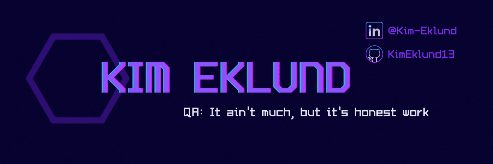

  </a>

# Howdy, Y'all! 

My name is Kim Eklund and I'm a QA engineer. I was born and raised in Southern California but have made Austin, TX my new home. I'm currently working at Cubic on the Umo app team. You can find me on [![LinkedIn][1.2]][2]

## 👾 Hobbies and Interests
- Honing my Web and Mobile Test Automation skills
- Volunteering for open-source projects
- Teaching QA to those wanting to make a career change into software development
- Investing in crypto and <strike>stonks</strike> stocks 
- Competing in weightlifting sports such as Bodybuilding, Strongman and Powerlifting

## 🔧 Technologies & Tools Experience

#### Languages

#### Automation Development and Testing

#### CI

#### Web Development

## &#x1f4c8; GitHub Stats

  

<!-- links to social media icons -->

<!-- icons without padding -->

[1.2]: https://raw.githubusercontent.com/MartinHeinz/MartinHeinz/master/linkedin-3-16.png (LinkedIn icon without padding)

<!-- links to your social media accounts -->

[2]: https://www.linkedin.com/in/kim-eklund/

<!-- Resources -->
<!-- Icons: https://simpleicons.org/ -->
<!-- GitHub Stats: https://github.com/anuraghazra/github-readme-stats -->
<!-- Emojis: https://emojipedia.org/emoji/ -->
<!-- HTML Emojis: https://www.fileformat.info/index.htm -->
<!-- Shields: https://shields.io/ -->
<!-- Awesome GitHub Profile README: https://github.com/abhisheknaiidu/awesome-github-profile-readme -->
